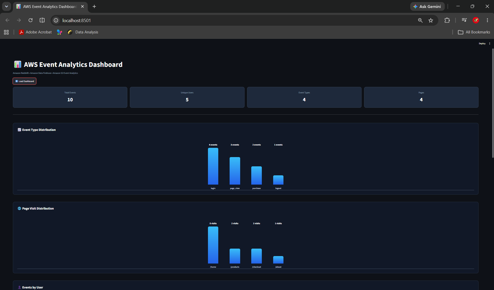
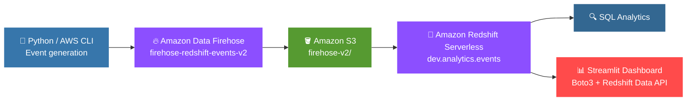
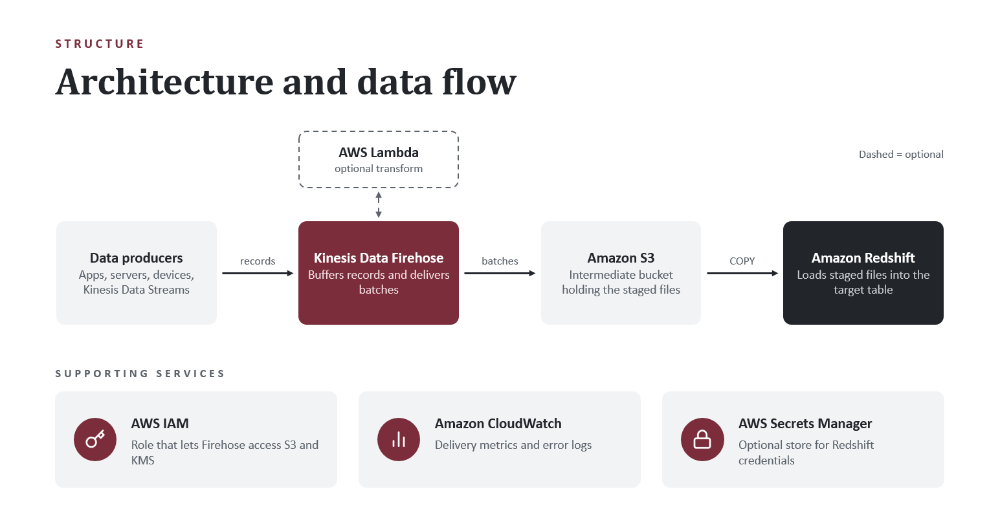
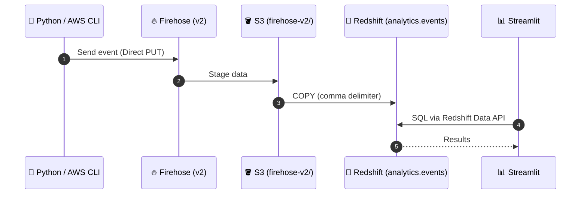
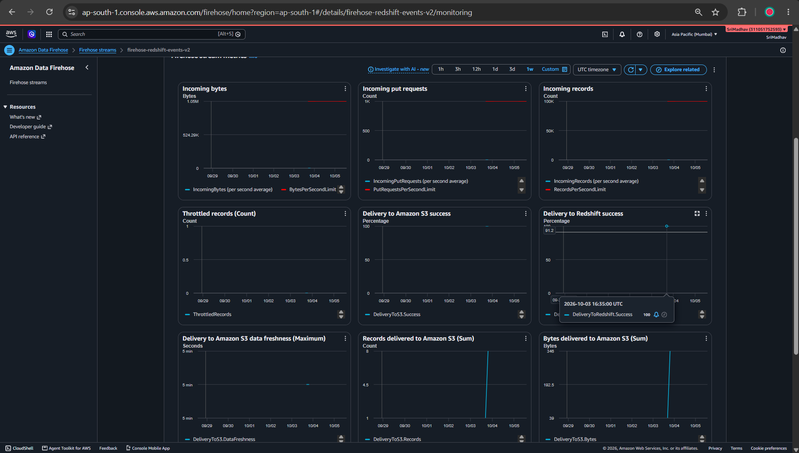
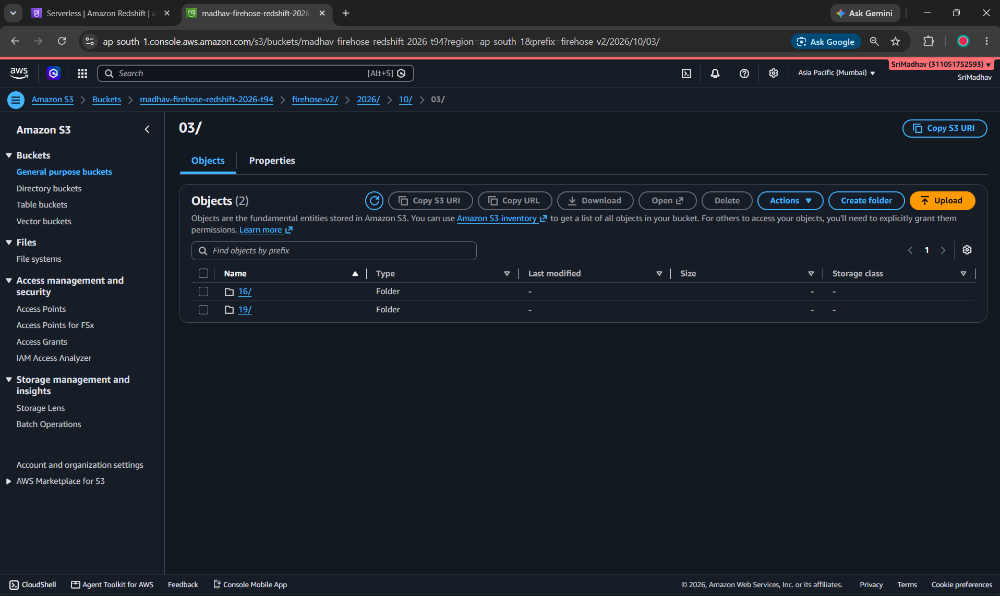
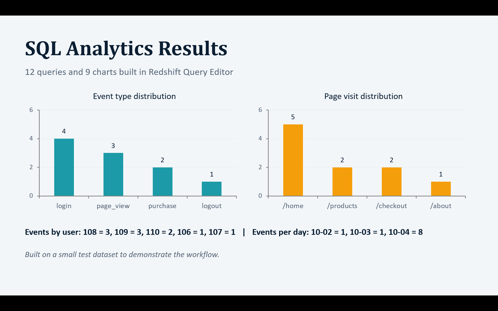
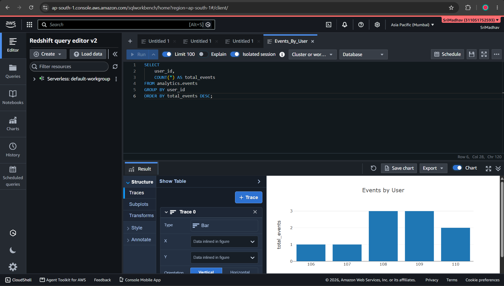

<div align="center">

# ⚡ AWS Data Engineering Project
### End-to-End Event Analytics Pipeline

**From a single event to a live dashboard — fully on AWS.**


`Python / AWS CLI` ➜ `Amazon Data Firehose` ➜ `Amazon S3` ➜ `Amazon Redshift Serverless` ➜ `SQL Analytics` ➜ `Streamlit Dashboard`

<br>



</div>

---

## 📑 Table of Contents

1. [Project Overview](#1--project-overview)
2. [Architecture](#2--architecture)
3. [Project Objectives](#3--project-objectives)
4. [AWS Services Used](#4--aws-services-used)
5. [Data Flow](#5--data-flow)
6. [Redshift Analytics](#6--redshift-analytics)
7. [Analytics Results](#7--analytics-results)
8. [Streamlit Dashboard](#8--streamlit-dashboard)
9. [Dashboard Technology](#9--dashboard-technology)
10. [Project Structure](#10--project-structure)
11. [Screenshots](#11--screenshots)
12. [Local Dashboard Setup](#12--local-dashboard-setup)
13. [Security](#13--security)
14. [Challenges and Troubleshooting](#14--challenges-and-troubleshooting)
15. [Key Learnings](#15--key-learnings)
16. [Future Improvements](#16--future-improvements)
17. [Technologies](#17--technologies)
18. [Author](#18--author)
19. [Project Summary](#19--project-summary)

---

## 1. 🚀 Project Overview

Most projects show you a database. This one shows you **the whole journey**: an event is generated, ingested, staged, loaded into a warehouse, analyzed with SQL, and finally rendered in a dashboard.

| ⚙️ Setting | 📌 Value |
|:--|:--|
| 🌏 AWS Region | `ap-south-1` (Asia Pacific – Mumbai) |
| 🔥 Firehose delivery stream | `firehose-redshift-events-v2` |
| 📥 Firehose source | Direct PUT |
| 🪣 S3 staging bucket | `madhav-firehose-redshift-2026-t94` |
| 📂 S3 prefix | `firehose-v2/` |
| 🏢 Redshift Serverless workgroup | `default-workgroup` |
| 🗄️ Database | `dev` |
| 📚 Schema | `analytics` |
| 📋 Table | `analytics.events` |
| 🧱 Columns | `event_id`, `event_type`, `user_id`, `page`, `event_time` |
| ✂️ COPY delimiter | Comma (`,`) |
| 🔄 Data transformation | Off |

---

## 2. 🏗️ Architecture



<div align="center">

</div>

---

## 3. 🎯 Project Objectives

- 🔗 Build a complete event analytics pipeline on AWS, from event generation to visualization.
- 📥 Ingest event data using Amazon Data Firehose with Direct PUT.
- 🪣 Stage the data in Amazon S3 and load it into Amazon Redshift Serverless.
- 🔍 Analyze the data with SQL in Redshift.
- 📊 Build a Streamlit dashboard that queries Redshift through the Redshift Data API.
- 🛠️ Troubleshoot data formatting, IAM permissions, and Redshift loading issues.

---

## 4. ☁️ AWS Services Used

| Service | Role in the pipeline |
|:--|:--|
| 🔥 **Amazon Data Firehose** | Ingests event records (Direct PUT) and delivers them toward Redshift via S3 |
| 🪣 **Amazon S3** | Staging storage before the Redshift `COPY` |
| 🏢 **Amazon Redshift Serverless** | Data warehouse for `analytics.events` and SQL analytics |
| 🔌 **Redshift Data API** | Lets the dashboard run SQL without database drivers |
| 🔐 **AWS IAM** | Access for Firehose, Redshift, and dashboard |
| 📈 **Amazon CloudWatch** | Firehose monitoring |
| 💻 **AWS CLI** | Sending test events and managing resources |

---

## 5. 🔄 Data Flow



1. **Event generation:** Events are created with Python / AWS CLI, each with an event ID, event type, user ID, page, and timestamp.
2. **Ingestion:** Events go to the Firehose delivery stream `firehose-redshift-events-v2` (Direct PUT, transformation off).
3. **Staging:** Data is staged in `madhav-firehose-redshift-2026-t94` under `firehose-v2/`.
4. **Loading:** Data is loaded into `analytics.events` in `dev` using a Redshift `COPY` with a comma delimiter.
5. **Analytics:** SQL queries run against `analytics.events`.
6. **Visualization:** The dashboard queries Redshift through Boto3 and the Redshift Data API.

### 🧱 Table: `analytics.events`

| Column | Description |
|:--|:--|
| `event_id` | Event identifier |
| `event_type` | Type of event (login, page_view, purchase, logout) |
| `user_id` | User who triggered the event |
| `page` | Page associated with the event |
| `event_time` | Time the event occurred |

<table>
<tr>
<td align="center"><b>📈 Firehose Monitoring</b><br></td>
<td align="center"><b>🪣 Data Staged in S3</b><br></td>
</tr>
</table>

---

## 6. 🔍 Redshift Analytics

SQL analytics performed on `analytics.events`:

| # | Analysis |
|:-:|:--|
| 1 | 📊 Total events |
| 2 | 🏷️ Events by type |
| 3 | 👤 Events by user |
| 4 | 📄 Page visits |
| 5 | ⏱️ Events over time |
| 6 | 🧑‍💻 User activity |
| 7 | 👥 Event type unique users |
| 8 | 🛒 Purchases by user |
| 9 | 👀 Page views by user |
| 10 | 🔀 Event types per user |
| 11 | 🔑 Logins by user |

<table>
<tr>
<td align="center"><b>🧾 SQL Analytics</b><br></td>
<td align="center"><b>🏢 Redshift Query</b><br></td>
</tr>
</table>

---

## 7. 📊 Analytics Results

The initial test dataset contained **10 events**.

<div align="center">

| 🧮 Total Events | 👤 Unique Users | 🏷️ Event Types | 📄 Pages |
|:-:|:-:|:-:|:-:|
| **10** | **5** | **4** | **4** |

</div>

**🏷️ Events by type**

| Event type | Count | |
|:--|:-:|:--|
| login | 4 | `████████` |
| page_view | 3 | `██████` |
| purchase | 2 | `████` |
| logout | 1 | `██` |

**📄 Page visits**

| Page | Count | |
|:--|:-:|:--|
| /home | 5 | `██████████` |
| /products | 2 | `████` |
| /checkout | 2 | `████` |
| /about | 1 | `██` |

---

## 8. 📺 Streamlit Dashboard

The dashboard reads live from Redshift and presents:

| 🎛️ KPI cards | 📈 Charts and tables |
|:--|:--|
| Total Events | Event Type Distribution |
| Unique Users | Page Visit Distribution |
| Event Types | Events by User |
| Pages | Events Over Time |
| | Recent Events |

<div align="center">

</div>

---

## 9. 🧰 Dashboard Technology

| Tech | Why |
|:--|:--|
| 🐍 **Python** | Application language |
| 🎈 **Streamlit** | Web interface |
| ☁️ **Boto3** | AWS access |
| 🔌 **Redshift Data API** | Runs SQL against Redshift Serverless |

> 💡 **Design choice:** the final dashboard intentionally avoids **pandas, Plotly, and psycopg2** and uses only **Boto3 + the Redshift Data API**. See [Challenges and Troubleshooting](#14--challenges-and-troubleshooting).

---

## 10. 🗂️ Project Structure

```
aws-dashboard/
├── 📄 app.py               # Streamlit dashboard
├── 📄 requirements.txt     # streamlit, boto3
├── 📄 .gitignore
├── 📄 README.md
└── 📁 screenshots/
    ├── 🖼️ 01-architecture.png
    ├── 🖼️ 02-firehose-monitoring.png
    ├── 🖼️ 03-s3-data.png
    ├── 🖼️ 04-sql-analytics.png
    ├── 🖼️ 05-redshift-query.png
    └── 🖼️ 06-dashboard.png
```

---

## 11. 🖼️ Screenshots

<table>
<tr>
<td align="center"><b>1️⃣ Architecture</b><br></td>
<td align="center"><b>2️⃣ Firehose Monitoring</b><br></td>
<td align="center"><b>3️⃣ S3 Data</b><br></td>
</tr>
<tr>
<td align="center"><b>4️⃣ SQL Analytics</b><br></td>
<td align="center"><b>5️⃣ Redshift Query</b><br></td>
<td align="center"><b>6️⃣ Dashboard</b><br></td>
</tr>
</table>

---

## 12. 💻 Local Dashboard Setup

**Prerequisites**

- 🐍 Python 3
- 💻 AWS CLI configured with credentials that can use the Redshift Data API for your workgroup
- 🏢 A Redshift Serverless workgroup with the `analytics.events` table loaded

```bash
# 1. Clone the repository
git clone https://github.com/Gannina-SriMadhav/aws-firehose-redshift-dashboard.git
cd aws-firehose-redshift-dashboard

# 2. Create and activate a virtual environment
python -m venv venv
venv\Scripts\activate        # Windows
# source venv/bin/activate   # macOS / Linux

# 3. Install dependencies
pip install -r requirements.txt

# 4. Configure AWS credentials (stored outside the repository)
aws configure

# 5. Launch the dashboard
streamlit run app.py
```

Use region `ap-south-1`, and make sure the credentials can call the Redshift Data API against `default-workgroup`.

---

## 13. 🔒 Security

> ⚠️ **Never commit AWS access keys, secret keys, passwords, or database credentials to GitHub.**

- 🔑 Keep credentials in the AWS CLI configuration or environment variables, outside the repository.
- 🙈 `.gitignore` excludes `venv/`, `__pycache__/`, `*.pyc`, `.env`, and `.aws/`.
- 🛡️ Grant IAM only the permissions each component needs (Firehose, Redshift, dashboard).
- ♻️ If a credential is ever exposed, revoke or rotate it immediately.

---

## 14. 🧯 Challenges and Troubleshooting

### ❌ → ✅ Firehose to Redshift: "Delimiter not found"

| | |
|:--|:--|
| ❌ **Problem** | The first Firehose stream failed to load into Redshift. Redshift reported **"Delimiter not found"** during `COPY`: the delivered records did not match the delimiter `COPY` expected. |
| ✅ **Fix** | A new stream, **`firehose-redshift-events-v2`**, was created with Direct PUT, transformation off, S3 prefix `firehose-v2/`, and a **comma (`,`)** COPY delimiter. Data then loaded into `analytics.events` successfully. |

### 🧩 Other issues

| Issue | Area |
|:--|:--|
| 📝 PowerShell file encoding | Data formatting of test files |
| 📥 Firehose-to-Redshift COPY errors | Redshift loading |
| 🔐 IAM permissions | Firehose, Redshift, and dashboard access |
| 🪟 Windows Application Control restrictions | Affected Python libraries |

> 🧠 **Result:** because of the Application Control restrictions, the final dashboard avoids pandas, Plotly, and psycopg2 and uses **Boto3 + the Redshift Data API**.

---

## 15. 🧠 Key Learnings

- 🌊 Seeing the complete flow, from event generation to visualization, teaches more than working with a database alone.
- 📐 Data formatting (delimiters, encoding) must match what Redshift `COPY` expects.
- 🔐 IAM permissions across Firehose, S3, and Redshift need careful setup.
- 🔌 The Redshift Data API can replace database drivers when local library restrictions apply.
- 📈 CloudWatch helps with monitoring Firehose.

---

## 16. 🔮 Future Improvements

- [ ] ⚡ AWS Lambda transformations
- [ ] 🔐 AWS KMS encryption
- [ ] 🗝️ AWS Secrets Manager
- [ ] ✅ Data validation
- [ ] 📦 Larger datasets
- [ ] 🎚️ Dashboard filters
- [ ] 🌐 Dashboard deployment
- [ ] 🔁 CI/CD pipeline

---

## 17. 🛠️ Technologies


---

## 18. 👨‍💻 Author

<div align="center">

### **G Sri Madhav**

[](https://github.com/Gannina-SriMadhav)

</div>

---

## 19. 🏁 Project Summary

<div align="center">

**Event ➜ Firehose ➜ S3 ➜ Redshift ➜ SQL ➜ Dashboard**

A complete AWS event analytics pipeline: events ingested with Amazon Data Firehose, staged in Amazon S3, loaded into Amazon Redshift Serverless, analyzed with SQL, and visualized in a Streamlit dashboard built on Boto3 and the Redshift Data API. It also covers real troubleshooting of data formatting, IAM permissions, Redshift loading, and local environment restrictions.

⭐ *If you found this project useful, consider giving it a star!* ⭐

</div>
